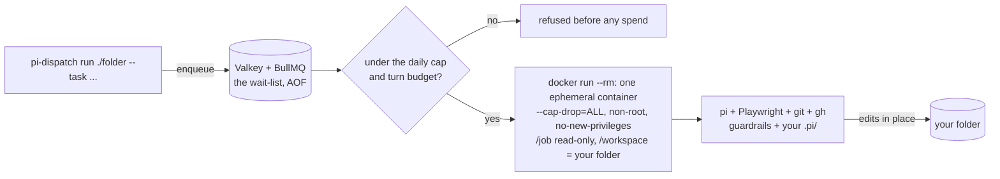
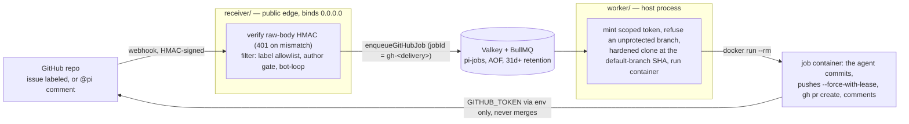
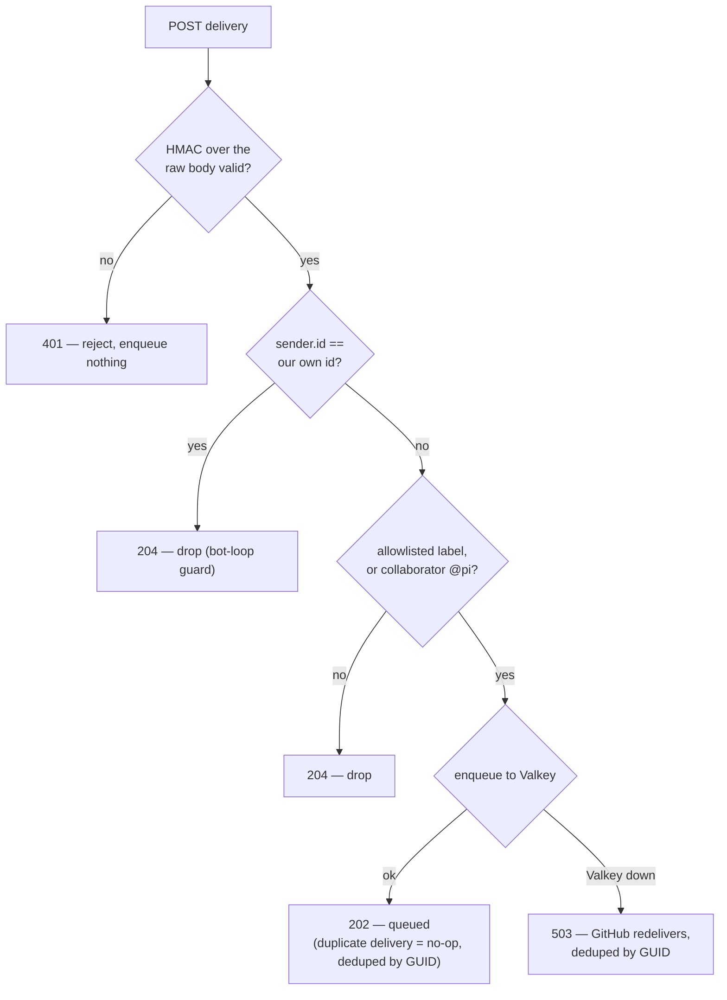

# pi-dispatch

**Run the [pi](https://github.com/earendil-works/pi) coding agent, in a container, against your own
folders — on your own machine or server.**

> `pi-dispatch` below is `npx pi-dispatch` from the repo (a workspace bin); or `npm link` it onto your PATH.

Point it at a project folder, give it a task, and pi does the work inside a locked-down container:

```
npx pi-dispatch run ./my-project --task "dedupe the imports in src/" --flow tidy
```

pi is an excellent agent. It has no job queue, no concurrency control, no spend limit, and — by its own
README — no permission system. pi-dispatch is that missing layer, and nothing else: a durable queue, a
per-job container boundary, a turn budget, and a daily spend cap. Everything below the container is pi;
everything above it is a few hundred lines of code.

**Your project tells the agent what to do**, using pi's own layout — `.pi/APPEND_SYSTEM.md` for the
persona, `.pi/skills/<name>/SKILL.md` for skills. Not a format we invented; pi's native skills, read
from your committed files. pi-dispatch ships no persona of its own — only a small, immutable safety floor
baked into the image that your instructions add to and cannot remove.

---

## Quickstart (local folders)

You need **Docker** and **Node ≥ 22.19**, and a provider API key (e.g. Anthropic).

```bash
# 1. Build the job image (once)
docker build -f image/Dockerfile -t pi-job:latest .

# 2. Start Valkey (the durable job queue)
docker compose -f deploy/docker-compose.yml up -d

# 3. Configure
cp .env.example .env         # then set ANTHROPIC_API_KEY (or your provider's key)
npm ci

# 4. Run the worker in one terminal
npx pi-dispatch worker       # (or: npm --workspace worker start)

# 5. Queue a job from another
npx pi-dispatch run ./my-project --task "add type hints to utils.py" --flow tidy
```

The worker picks up the job, mounts your folder into a container, and pi edits it **in place**. It
refuses a dirty git working tree unless you pass `--force`, because there is no undo — point it at
folders you can restore, and commit first.

## What runs, and what protects you



- **The container is the security boundary.** pi has no permission system, so every job runs
  `--cap-drop=ALL`, non-root, ephemeral, with your instructions mounted read-only. The agent cannot
  rewrite its own guardrails or reach your host.
- **Spend is bounded twice.** A per-job **turn budget** (pi has none of its own) and a **daily cap**
  checked *before* a container starts, so a runaway can't quietly burn your API budget. Also set a spend
  limit on the API key itself.
- **Nothing is dropped.** Fifty jobs at once become fifty queued jobs, drained at a fixed concurrency
  (default 3). Valkey persists them across a reboot.

Read [`SECURITY.md`](SECURITY.md) before you rely on it — it states plainly what is and is not defended.

## Run as a service

`pi-dispatch worker` is a long-running process — run it in a terminal, or hand it to your OS's service
manager so it starts on boot and restarts on a crash. The units in [`deploy/`](deploy/) are **per-host
templates, not turnkey**: each carries `<PLACEHOLDER>` paths you fill in for your machine. The systemd
unit's *structure* is checked by `systemd-analyze`; the launchd and nssm units are worked examples. All
three run the worker on the **host** — it drives the `docker` CLI and is not itself containerised — so
they need the AOF-enabled Valkey from [`deploy/docker-compose.yml`](deploy/docker-compose.yml) running
alongside, which is what makes the queue **and the pause state** survive a reboot.

**Steer the running worker** without stopping it — these commands talk to Valkey, so they work whether the
worker runs in a terminal or under a service manager:

- `pi-dispatch pause` — stop taking new jobs. **Durable**: the pause lives in the queue and survives a
  worker restart, so a paused worker comes back paused after a reboot. Jobs still enqueue; they just wait.
- `pi-dispatch resume` — start taking jobs again.
- `pi-dispatch status` — prints `{ pausedState, waiting, active, paused, delayed, failed }`. `pausedState`
  is the switch; `paused` is the backlog **count** of jobs that piled up while paused (they land in the
  `paused` list, not `waiting`).

### Linux (systemd)

Edit [`deploy/worker.service`](deploy/worker.service): set `WorkingDirectory`, `EnvironmentFile`, `User`,
and the `node` path to your clone. Then install and start it:

```bash
sudo cp deploy/worker.service /etc/systemd/system/
sudo systemctl daemon-reload
sudo systemctl enable --now worker
```

`systemctl stop worker` sends **SIGTERM** — the worker stops accepting jobs and lets the in-flight
container drain before it exits.

### macOS (launchd)

Edit [`deploy/com.pi-dispatch.worker.plist`](deploy/com.pi-dispatch.worker.plist) and its wrapper
[`deploy/worker-env-wrapper.sh`](deploy/worker-env-wrapper.sh): set the repo-root and log paths (launchd
has no `EnvironmentFile`, so the wrapper loads `.env` at runtime). Then bootstrap it:

```bash
launchctl bootstrap gui/$(id -u) deploy/com.pi-dispatch.worker.plist
```

`launchctl bootout gui/$(id -u)/com.pi-dispatch.worker` sends **SIGTERM** for the same graceful drain.

### Windows (nssm)

Put `nssm.exe` on PATH ([nssm.cc](https://nssm.cc)), set `SERVICE` / `REPO` / `LOGDIR` in
[`deploy/nssm-install.cmd`](deploy/nssm-install.cmd), then run it and start the service:

```
deploy\nssm-install.cmd
nssm start pi-dispatch-worker
```

The wrapper [`deploy/worker-env-wrapper.cmd`](deploy/worker-env-wrapper.cmd) loads `.env` at runtime. A
console-stop (`nssm stop pi-dispatch-worker`) sends the worker a signal it handles, so it drains
gracefully.

### Drain before a planned restart

A planned restart should abort no in-flight job. Pause, wait for the queue to go idle, restart, then
resume:

```bash
pi-dispatch pause                     # stop taking new jobs (durable)
pi-dispatch status                    # repeat until "active": 0 — nothing in flight
sudo systemctl restart worker         # (or the launchctl / nssm equivalent)
pi-dispatch resume                    # take jobs again
```

Because the pause is durable, the worker comes back paused even if the restart outruns your `resume`, so
nothing slips through in the gap.

**Windows caveat**: stop the service with nssm's **console-stop** (`nssm stop`), which delivers a signal
the worker handles and drains gracefully. Task Scheduler is a weaker fallback — it stops a task with a
hard kill, giving the worker no chance to drain; a job killed mid-flight leaves a stray container that the
worker's **boot reaper** clears on the next start, rather than draining cleanly.

## Admin (pi extension)

The admin surface is a **pi extension** in [`admin/`](admin/) that loads into *your own* interactive pi
session — no daemon, no web app, **no network port at all**. Load it with `pi -e admin/src/index.ts` from
this checkout, add that path to the `"extensions"` array in `~/.pi/agent/settings.json`, or just run pi
inside this checkout: the in-repo `.pi/extensions` shim auto-loads once you've trusted the project.

It adds `/dispatch` commands that run **locally, with no model involvement**:

- `status` — queue counts, paused state, budget; `budget` — today's spend against the daily cap
- `pause` / `resume` — the queue on/off switch
- `runs` / `logs` — recent run records, and one run's raw log
- `triggers` — the configured triggers (display only)
- `settings` / `set <key> <value>` / `unset <key>` — the runtime overlay

`/dispatch pause|resume|status` are a second interface over the **same durable switch** as
`pi-dispatch pause|resume|status` (see **Steer the running worker** above), not a new mechanism; `runs`
and `logs` read the **same** `logs/<jobId>.json` / `.log` files as **Run history** below. The extension
reads only queue counts, run records, and the settings overlay — none of which carry credentials.

The model-callable tools are **reads plus `pause`/`resume` only** — every settings write is an
operator-typed command, never a model tool — and a raw `.log` is untrusted container output that renders
in the overlay viewer only, never into model context. Settings land in the `settings.json` overlay
(`PI_SETTINGS_FILE`; keys `model`, `provider`, `maxTurns`, `dailyCap`, `concurrency`) and take effect per
job — `concurrency` at the next pickup. The supported pi version is the pinned `0.80.7`; the load-time
capability probe is all-or-nothing and refuses loudly on any other version.

## Run history

The worker keeps a durable, per-job record under `PI_LOGS_DIR` (default: your OS temp dir,
`.../pi-dispatch/logs`). Every job writes an id-only status record `logs/<jobId>.json` — stable ids only
(the delivery GUID, `repo#issue`), never issue or comment text. Set `PI_CAPTURE_JOB_LOGS=1` to **also**
capture the container's raw stdout/stderr to `logs/<jobId>.log`; this is **opt-in and off by default**,
because that raw stream can contain issue and comment text (PII). Both files stay host-side, are never
mounted into the job container, and are gitignored. A boot-time sweep prunes anything older than
`PI_LOG_RETENTION_DAYS` (default 30; `0` keeps them forever).

## Scheduling recurring jobs

A cron schedule is a trigger, not a new job kind: each entry runs a local folder through a flow on a cron
pattern. Cron is **off by default** — the worker reads schedules only when `PI_SCHEDULES_FILE` points at a
file.

```bash
# 1. Copy the template and edit it
cp schedules.example.json schedules.json   # then edit "folder" to a REAL absolute path

# 2. Point the worker at it (absolute path), and restart the worker
#    In .env:  PI_SCHEDULES_FILE=/absolute/path/to/schedules.json
npx pi-dispatch worker
```

Each entry sets `id`, `cron` (5 or 6 fields), `folder`, `flow`, and `task`; `provider`, `model`, and
`maxTurns` are optional and fall back to the worker's defaults. A schedule's `folder` is a **host path** —
the worker runs on the host ([`DES-WORKER-ON-HOST`](specs/design.md)) and mounts that folder into the job
container, so it must be readable by the worker's user.

- **Local schedules only this slice.** `kind` must be `"local"`; the loader rejects `kind:"github"` at
  startup — a schedule has no webhook delivery, issue number, or body to work.
- **Editing `folder` is mandatory.** Copying `schedules.example.json` verbatim makes the worker **refuse
  to start** with `configError: folder does not exist` until `folder` names a real path. This is
  fail-loud on purpose: a broken schedule never silently fails to fire.

## Advanced: GitHub automation

pi-dispatch can also be triggered by GitHub — label an issue, and a container works it on a fresh clone,
opens a PR, and comments back. A repo **webhook** drives it (set a `WEBHOOK_SECRET`), and the worker
authenticates to GitHub via `GITHUB_AUTH_SOURCE`: `gh` (a `gh auth token`) or a repo-scoped fine-grained
**PAT** by default. A GitHub **App is optional** — it buys stronger token scoping and is what you need
for multi-tenant.



- Only a collaborator's label or `@pi` comment starts a job (the label *is* the approval step).
- The agent gets a **repo-scoped, short-lived token** — and, honestly: that token *can* merge, because
  GitHub gates push and merge behind the same `contents: write` scope. **Branch protection on your
  default branch is the real control**, so the worker **refuses** an unprotected repo. `SECURITY.md` has
  the detail.
- The **admin surface** is a pi extension (`admin/`) loaded into your own interactive pi session —
  `/dispatch` commands plus a TUI dashboard. It operates the queue (the same durable `queue.pause()` as
  `pi-dispatch pause`), shows runs, logs, and budget, and edits runtime settings via the `settings.json`
  overlay. It binds no port at all and triggers no jobs. It never edits your persona (those live in your
  project's `.pi/`, in git, reviewed) and does not edit flows this slice (deferred). See **Admin (pi
  extension)**.

Every delivery runs the same gate before anything is queued — the signature is checked over the raw bytes
*before* the body is parsed, and the `sender.id` bot-loop guard fires before the author check (so the
receiver's own comments can never re-trigger a job):



## Should you use this instead of the Claude Code GitHub Action?

For GitHub automation, often no — and you should know that up front.
[`anthropics/claude-code-action`](https://github.com/anthropics/claude-code-action) (MIT, ~8.4k stars) is
GA and does label-triggered issue automation for 10% of the effort. pi-dispatch is for a narrower case:
**you run pi, on your own hardware, and you want a real queue, a container boundary, and — the part the
action can't do — to run flows against local folders**, not just GitHub repos, without hosted-runner
minutes.

## Status

The local-folder path (image, worker, `pi-dispatch run` / `worker`), the GitHub webhook path
(receiver → queue → clone → PR), and scheduled (cron) triggers for local folders are built and work; the
worker runs in a terminal or as an OS service on Linux, macOS or Windows (see **Run as a service**). The
admin surface ships as a pi extension (see **Admin (pi extension)**). The design is specified in
[`specs/`](specs/) — start with [`specs/constitution.md`](specs/constitution.md) for the non-negotiables
and [`specs/design.md`](specs/design.md) for the decisions and what was rejected.

## Contributing

PRs welcome. Sign off your commits (`git commit -s`) — this project uses the
[DCO](https://developercertificate.org/), not a CLA. If you change behaviour, the spec changes with it:
`specs/` is the source of truth, and a PR that violates a `CONST-*` entry will be asked to justify the
constraint first, not the code.

## License

MIT. See [LICENSE](LICENSE). Built on [pi](https://github.com/earendil-works/pi) by Mario Zechner, which
does the actual hard part.

> **Not affiliated with** the unrelated npm package `pi-dispatch`, a pi extension for rotating ChatGPT
> Codex OAuth accounts. Same name, different thing — this project is not distributed via npm.
