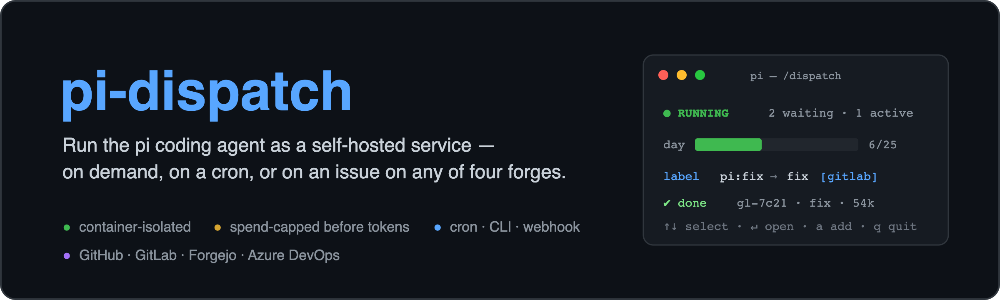
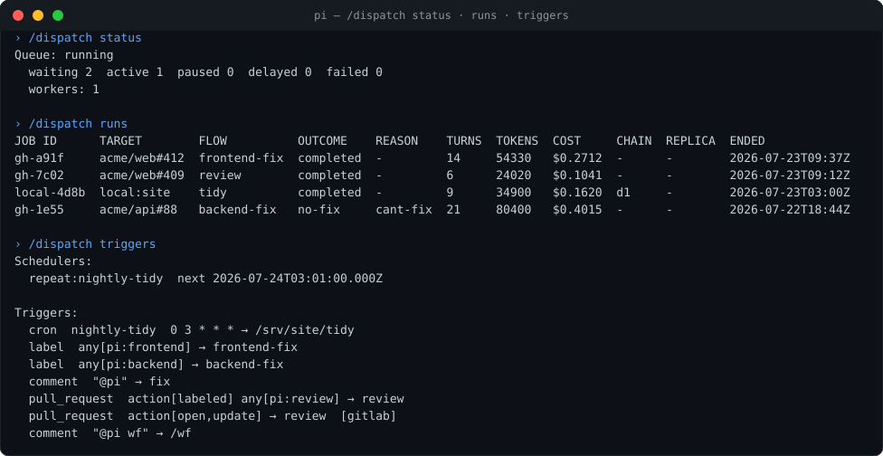
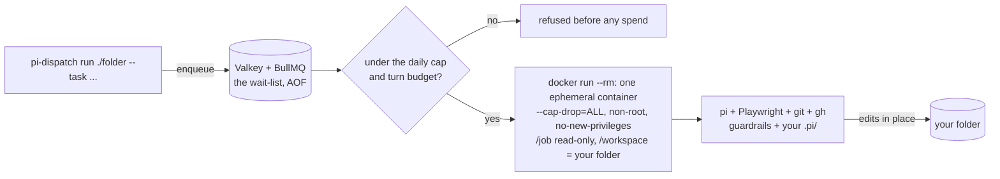
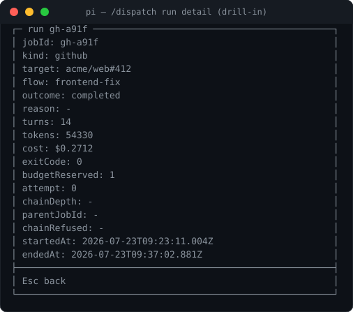
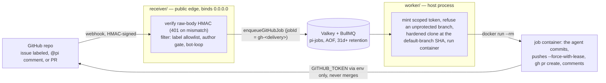
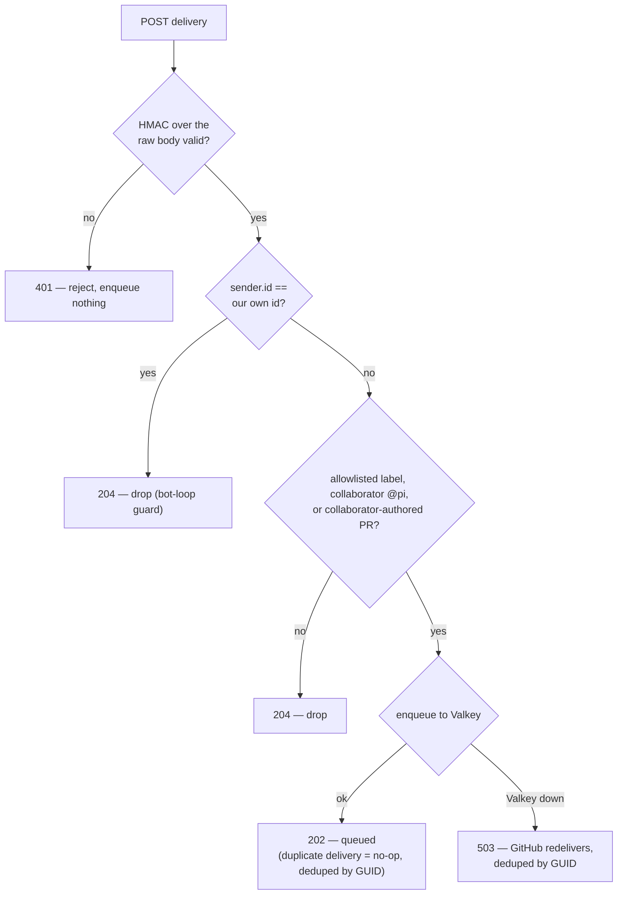

<p align="center">
  
</p>

# pi-dispatch

**Run the [pi](https://github.com/earendil-works/pi) coding agent as a service — triggered on demand, on a
cron schedule, or by a GitHub issue or pull request — in a container you control, with a durable queue, a
spend cap, and a live admin panel.**




pi has no job queue, no concurrency control, no spend limit, and — by its own README — no permission
system. **pi-dispatch is exactly that missing operational layer, and nothing else.**

- **The container is the boundary.** Every job runs `--cap-drop=ALL`, non-root, ephemeral, instructions
  mounted read-only — pi's missing permission system, enforced by Docker.
- **Spend is bounded before a container starts** — a per-job turn budget and a daily cap, checked before
  a single token is spent.
- **The image is yours to shape.** Bake a project's toolchain into [`image/Dockerfile`](image/Dockerfile);
  it ships **Playwright + Chromium**, so a flow can build a frontend, screenshot it, and iterate on the
  rendered result — the edge over a fixed hosted routine or `/loop`.
- **Three triggers, one job.** A CLI command, a cron schedule, or a GitHub issue/PR — same job, same box,
  same panel. Cron is the unattended one: recurring work on your own hardware, in an image you control.
- **Your project steers it** — pi's native `.pi/skills` and persona, from your committed files, over a
  small immutable safety floor the agent can't remove.

## Quickstart (local folders)

You need **Docker** and **Node ≥ 22.19**, and a provider API key (e.g. Anthropic).

```bash
# 1. Get the job image — pull the prebuilt one (fast)...
docker pull ghcr.io/edgehero/pi-job:latest && docker tag ghcr.io/edgehero/pi-job:latest pi-job:latest
#    ...or bake your own toolchain into it instead (slower, fully yours):
#    docker build -f image/Dockerfile -t pi-job:latest .

# 2. Start Valkey (the durable job queue)
docker compose -f deploy/docker-compose.yml up -d

# 3. Install, scaffold, and check your setup
npm ci
npx pi-dispatch init         # writes .env + triggers.json + pause-windows.json (never clobbers)
#    edit .env — set ANTHROPIC_API_KEY (or your provider's key)
#    already logged into pi? set PI_AUTH_FROM_PI=1 instead and it reuses the key from ~/.pi/agent/auth.json
npx pi-dispatch doctor       # ✓/✗ preflight: Docker, Valkey, the image, and your provider key

# 4. Run the worker in one terminal
npx pi-dispatch worker       # (or: npm --workspace worker start)

# 5. Queue a job from another
npx pi-dispatch run ./my-project --task "add type hints to utils.py" --flow tidy
```

> **The prebuilt image is a snapshot** of this repo's runner + guardrails at its build. To bake a project's
> toolchain in (the edge cron/visual flows rely on), build `image/Dockerfile` yourself — step 1's second form.

> **Heads-up on the CLI name.** `pi-dispatch` here is *this repo's* workspace CLI (`worker/src/cli.mjs`),
> which `npx` resolves from the local `node_modules/.bin` after `npm ci` — run these from the repo root. It
> is **not** the unrelated npm package `pi-dispatch` (see [License](#license)); this project isn't published
> to npm. If a shell can't find the local bin, use the explicit form:
> `node worker/src/cli.mjs run ./my-project --task "…" --flow tidy`.

The worker picks up the job, mounts your folder into a container, and pi edits it **in place**. It
refuses a dirty git working tree unless you pass `--force`, because there is no undo — point it at
folders you can restore, and commit first.

## What runs, and what protects you

The local path, end to end — the same queue, container, and budget every trigger flows through:



A container boundary, spend bounded *before* a container starts, nothing dropped — that is what this path
enforces. Read [`SECURITY.md`](SECURITY.md) before you rely on it: it states plainly what is and is not
defended.

## Reuse your existing pi setup

Already run `pi`? Give every job your host setup — custom models, global skills, a global persona — **layered
under each repo's own `.pi/`** (the repo still wins). Works with the pulled image; it's a read-only mount, not
a rebuild.

```bash
pi-dispatch import-pi          # stage a credential-free copy of ~/.pi/agent into ./pi-global
# then set PI_GLOBAL_PI_DIR=/abs/path/to/pi-global in .env, and:
pi-dispatch doctor             # verifies the overlay carries no credential
```

The overlay is mounted `/opt/pi-global:ro` into every container. Skills merge with the repo's (a repo skill
of the same name overrides the global one); the prompt layers `guardrails → global persona → repo persona`,
the safety floor always first and unremovable. `import-pi` **refuses** a `models.json` with a literal key and
**never** copies `auth.json` — your credential stays in the environment. Extensions are opt-in and armed
separately (`--with-extensions` + `PI_GLOBAL_ALLOW_EXTENSIONS=1`) because they run code against adversarial
input; the admin extension is hard-blocked. Full reference: [`docs/global-pi-overlay.md`](docs/global-pi-overlay.md).

**Already logged into pi and don't want to restate the key?** Set `PI_AUTH_FROM_PI=1`. When the provider key
is absent from the worker's environment, the worker reads it **host-side** from `~/.pi/agent/auth.json` and
env-injects it into the job — a host-side read of a host-held secret, never a file mounted into the container.
**API-key logins only**: an OAuth/subscription login (`pi login`) is refused — those tokens expire and can't
be refreshed in the container, and a subscription isn't the credential for an unattended service; use an API
key with a spend limit.

## Run as a service

`pi-dispatch worker` is a long-running process — run it in a terminal, or hand it to your OS's service
manager so it starts on boot and restarts on a crash. The units in [`deploy/`](deploy/) are **per-host
templates, not turnkey**: each carries `<PLACEHOLDER>` paths you fill in for your machine. The systemd
unit's *structure* is checked by `systemd-analyze`; the launchd and nssm units are worked examples. All
three run the worker on the **host** — it drives the `docker` CLI and is not itself containerised — so
they need the AOF-enabled Valkey from [`deploy/docker-compose.yml`](deploy/docker-compose.yml) running
alongside, which is what makes the queue **and the pause state** survive a reboot.

**Steer the running worker** without stopping it — these commands talk to Valkey, so they work whether the
worker runs in a terminal or under a service manager:

- `pi-dispatch pause` — stop taking new jobs. **Durable**: the pause lives in the queue and survives a
  worker restart, so a paused worker comes back paused after a reboot. Jobs still enqueue; they just wait.
- `pi-dispatch resume` — start taking jobs again.
- `pi-dispatch status` — prints `{ pausedState, waiting, active, paused, delayed, failed }`. `pausedState`
  is the switch; `paused` is the backlog **count** of jobs that piled up while paused (they land in the
  `paused` list, not `waiting`).

### Linux (systemd)

Edit [`deploy/worker.service`](deploy/worker.service): set `WorkingDirectory`, `EnvironmentFile`, `User`,
and the `node` path to your clone. Then install and start it:

```bash
sudo cp deploy/worker.service /etc/systemd/system/
sudo systemctl daemon-reload
sudo systemctl enable --now worker
```

`systemctl stop worker` sends **SIGTERM** — the worker stops accepting jobs and lets the in-flight
container drain before it exits.

### macOS (launchd)

Edit [`deploy/com.pi-dispatch.worker.plist`](deploy/com.pi-dispatch.worker.plist) and its wrapper
[`deploy/worker-env-wrapper.sh`](deploy/worker-env-wrapper.sh): set the repo-root and log paths (launchd
has no `EnvironmentFile`, so the wrapper loads `.env` at runtime). Then bootstrap it:

```bash
launchctl bootstrap gui/$(id -u) deploy/com.pi-dispatch.worker.plist
```

`launchctl bootout gui/$(id -u)/com.pi-dispatch.worker` sends **SIGTERM** for the same graceful drain.

### Windows (nssm)

Put `nssm.exe` on PATH ([nssm.cc](https://nssm.cc)), set `SERVICE` / `REPO` / `LOGDIR` in
[`deploy/nssm-install.cmd`](deploy/nssm-install.cmd), then run it and start the service:

```
deploy\nssm-install.cmd
nssm start pi-dispatch-worker
```

The wrapper [`deploy/worker-env-wrapper.cmd`](deploy/worker-env-wrapper.cmd) loads `.env` at runtime. A
console-stop (`nssm stop pi-dispatch-worker`) sends the worker a signal it handles, so it drains
gracefully.

### Drain before a planned restart

A planned restart should abort no in-flight job. Pause, wait for the queue to go idle, restart, then
resume:

```bash
pi-dispatch pause                     # stop taking new jobs (durable)
pi-dispatch status                    # repeat until "active": 0 — nothing in flight
sudo systemctl restart worker         # (or the launchctl / nssm equivalent)
pi-dispatch resume                    # take jobs again
```

Because the pause is durable, the worker comes back paused even if the restart outruns your `resume`, so
nothing slips through in the gap.

**Windows caveat**: stop the service with nssm's **console-stop** (`nssm stop`), which delivers a signal
the worker handles and drains gracefully. Task Scheduler is a weaker fallback — it stops a task with a
hard kill, giving the worker no chance to drain; a job killed mid-flight leaves a stray container that the
worker's **boot reaper** clears on the next start, rather than draining cleanly.

## Admin (pi extension)

The admin surface — the dashboard and command transcript shown at the top of this README — is a **pi
extension** in [`admin/`](admin/) that loads into *your own* interactive pi session — no daemon, no web
app, **no network port at all**.

**Install it through pi** — the published package, then open the panel:

```bash
pi install npm:@edgehero/pi-dispatch-admin   # then, in pi:  /dispatch
```

Two other ways to load it: from a clone, the in-repo `.pi/extensions` shim auto-loads once you've trusted
the project; or point pi at the source with `pi -e admin/src/index.ts` (add that path to the `"extensions"`
array in `~/.pi/agent/settings.json` to make it permanent). To operate a **live** deployment, give the pi
session the same `VALKEY_URL`, `PI_SETTINGS_FILE`, `PI_TRIGGERS_FILE`, `PI_PAUSE_WINDOWS_FILE`, and
`PI_LOGS_DIR` the worker uses — the panel reads and writes those same files and queue, so both act on one
deployment.

Bare `/dispatch` opens the live dashboard overlay — one snapshot per second, `p`/`r` to pause/resume the
queue in place, `↑`/`↓` to move across the triggers and runs, `Enter` to drill into either. **Triggers are
editable in place**: `Enter` on a trigger shows its trust model, `e` edits its flow, `x` deletes it, `a`
adds one (guided, kind-first), and `s` edits a limit — every write is operator-typed, validated, atomic, and
**reloaded live** by the worker/receiver (no restart). `Enter` on a run opens its full PII-free record:



It adds `/dispatch` commands that run **locally, with no model involvement**:

- `status` — queue counts, paused state, budget; `budget` — today's spend against the daily cap
- `pause` / `resume` — the queue on/off switch
- `runs` / `logs` — recent run records, and one run's raw log
- `triggers` — the configured triggers (also editable from the overlay: `a`/`e`/`x`, applied live)
- `run <folder> <flow> [task]` — enqueue a flow against a local folder (operator-typed; the dirty-tree guard still applies)
- `settings` / `set <key> <value>` / `unset <key>` — the runtime overlay

`/dispatch pause|resume|status` are a second interface over the **same durable switch** as
`pi-dispatch pause|resume|status` (see **Steer the running worker** above), not a new mechanism; `runs`
and `logs` read the **same** `logs/<jobId>.json` / `.log` files as **Run history** below. The extension
reads only queue counts, run records, and the settings overlay — none of which carry credentials.

### Operating pi-dispatch from your AI

The extension is AI-operable, so your assistant can drive it — but **every change asks you to confirm
first**. The model-callable tools are: reads (`status`, `runs`, `triggers`); on/off (`pause`/`resume`, no
confirm — reversible and money-safe); the gated `dispatch_run` enqueue; and the **confirm-gated writes**
`dispatch_set` (change a limit) and `dispatch_trigger_add`/`_edit`/`_delete`. A write tool applies its
change **only after you approve a dialog showing the exact before→after**, and **refuses — writing nothing —
when no interactive operator is present** (so a prompt-injected session can't raise your cap or add a paid
trigger; the model emits the call, only your keypress approves it). The bundled `operate-pi-dispatch` skill
tells the model how to use those gates: state the change plainly, and accept a decline. `CONST-BUDGET-BEFORE-TOKENS`
and `CONST-TRIGGER-AUTHOR-GATE` are unchanged — the confirm is the human approval.

`dispatch_run` is the one model-callable tool that is **not money-safe**: unlike the others, it enqueues a
**PAID** agent run that edits a folder in place with **no undo** — and unlike the confirm-gated writes, it
has no operator confirm. It is bounded in blast-radius, not prevented, by **six** independent limits: the
folder allowlist `PI_DISPATCH_RUN_ROOTS` (realpath + containment); the committed per-flow
`ai-trigger: allow` opt-in read at HEAD (default **deny**); the dirty-tree refusal (no force option); no
spend-knob parameters on the tool; a per-hour rate limit; and the daily cap. Do not read it as money-safe
or reversible — it is neither. A raw `.log` is untrusted container output that renders in the overlay
viewer only, never into model context. Settings land in the `settings.json` overlay
(`PI_SETTINGS_FILE`; keys `model`, `provider`, `maxTurns`, `dailyCap`, `concurrency`) and take effect per
job — `concurrency` at the next pickup. The supported pi version is the pinned `0.80.7`; the load-time
capability probe is all-or-nothing and refuses loudly on any other version.

A flow becomes AI-triggerable only when its `.pi/skills/<flow>/SKILL.md` frontmatter sets
`ai-trigger: allow` (default **deny**); an AI trigger naming no such opted-in flow is refused.

A completed job can request follow-up flows by writing to a `/outbox` mount. The worker validates each
request host-side and enqueues **same-folder, local-parent only** (GitHub jobs never chain), gated by the
same `ai-trigger: allow` opt-in and bounded by `PI_CHAIN_DEPTH_MAX` and `PI_CHAIN_MAX_PER_JOB` — both
host-enforced, so the in-container agent controls nothing.

## Run history

The worker keeps a durable, per-job record under `PI_LOGS_DIR` (default: your OS temp dir,
`.../pi-dispatch/logs`). Every job writes an id-only status record `logs/<jobId>.json` — stable ids only
(the delivery GUID, `repo#number`), never issue or comment text. Set `PI_CAPTURE_JOB_LOGS=1` to **also**
capture the container's raw stdout/stderr to `logs/<jobId>.log`; this is **opt-in and off by default**,
because that raw stream can contain issue and comment text (PII). Both files stay host-side, are never
mounted into the job container, and are gitignored. A boot-time sweep prunes anything older than
`PI_LOG_RETENTION_DAYS` (default 30; `0` keeps them forever).

## Triggers: cron, labels, comments, pull requests

Every standing trigger — cron schedules and GitHub triggers alike — lives in one unified
**`triggers.json`**, a list of `{ on, run }` pairs read by both the worker (cron) and the receiver
(GitHub). Point both services at it with `PI_TRIGGERS_FILE`; the worker treats it as optional (unset =
cron off), the receiver requires it.

```jsonc
{ "triggers": [
  { "on": { "type": "cron", "id": "nightly", "pattern": "0 3 * * *" },
    "run": { "kind": "local", "folder": "/srv/site", "flow": "tidy", "task": "run the nightly tidy" } },
  { "on": { "type": "label", "any": ["pi:frontend"] },              "run": { "kind": "github", "flow": "frontend-fix" } },
  { "on": { "type": "comment", "phrase": "@pi" },                   "run": { "kind": "github", "flow": "fix" } },
  { "on": { "type": "pull_request", "action": ["labeled"], "any": ["pi:review"] }, "run": { "kind": "github", "flow": "review" } }
] }
```

The `on × run` matrix is the trust boundary, enforced fail-loud at load: a `cron` trigger must run
`local` (it has no webhook delivery, issue/PR number, or body), and every webhook trigger runs `github`.

### Scheduling recurring jobs

A cron trigger runs a local folder through a flow on a cron pattern — `pattern` is a 5- or 6-field cron
expression; `provider`, `model`, and `maxTurns` are optional on `run` and fall back to the worker's
defaults. A cron `folder` is a **host path** — the worker runs on the host
([`DES-WORKER-ON-HOST`](specs/design.md)) and mounts that folder into the job container, so it must be
readable by the worker's user.

```bash
cp triggers.example.json triggers.json   # then edit the cron entry's "folder" to a REAL absolute path
# In .env:  PI_TRIGGERS_FILE=/absolute/path/to/triggers.json
npx pi-dispatch worker
```

Copying `triggers.example.json` verbatim makes the worker **refuse to start** with
`configError: folder does not exist` until a cron trigger's `folder` names a real path — fail-loud on
purpose, so a broken trigger never silently fails to fire.

## Quiet hours — scoped pause windows

Pause a **specific folder or repo's** runs *between certain times* — recurring daily, optionally restricted to
certain weekdays or a date range, in a timezone of your choice — and resume automatically. Unlike
`pi-dispatch pause` (which stops the **whole** queue, untimed), a pause window is per-scope and scheduled, and
a paused job is **deferred, not dropped**: it waits in the queue and runs once the window ends. The check
happens **before** the budget reservation, so a deferred job spends nothing and counts nothing against the cap.

Copy `pause-windows.example.json` and point `PI_PAUSE_WINDOWS_FILE` at it (unset = off); the worker validates
it at boot and live-reloads edits:

```json
{ "windows": [
  { "scope": "acme/web",  "from": "22:00", "to": "06:00", "tz": "Europe/Amsterdam",
    "days": ["mon","tue","wed","thu","fri"] },
  { "scope": "/srv/site", "from": "09:00", "to": "17:00", "dateFrom": "2026-08-10", "dateTo": "2026-08-14" }
] }
```

`scope` is a repo `"owner/name"`, a local folder path, or `"*"` for all; `from > to` is an overnight window;
`days`/`dateFrom`/`dateTo` gate the day the window starts. Manage windows by editing the file, in the panel
(`/dispatch` → `w`), or through the confirm-gated `dispatch_pause_add`/`_delete` tools. Full field reference
and more examples: **[`docs/pause-windows.md`](docs/pause-windows.md)**.

## GitHub automation

pi-dispatch can also be triggered by GitHub — label an issue, and a container works it on a fresh clone,
opens a PR, and comments back. A repo **webhook** drives it (set a `WEBHOOK_SECRET`), and the worker
authenticates to GitHub via `GITHUB_AUTH_SOURCE`: `gh` (a `gh auth token`) or a repo-scoped fine-grained
**PAT** by default. A GitHub **App is optional** — it buys stronger token scoping and is what you need
for multi-tenant. Which labels, comment phrases, and pull_request actions fire which flow is configured in
the same unified **`triggers.json`** above; the receiver **requires** `PI_TRIGGERS_FILE`.



- Only a collaborator's label or `@pi` comment starts a job (the label *is* the approval step).
- Beyond labeled issues, pi-dispatch also handles **pull requests**: label a PR, comment on a PR, or fire
  automatically when a PR is opened or updated — the auto (`opened`/`synchronize`/`reopened`) path is
  gated on the PR author being a collaborator, so a fork PR from a stranger never auto-fires. A PR trigger
  just runs the configured flow; the flow (a repo skill) reviews, comments, or pushes to the PR via `gh`.
- The agent gets a **repo-scoped, short-lived token** — and, honestly: that token *can* merge, because
  GitHub gates push and merge behind the same `contents: write` scope. **Branch protection on your
  default branch is the real control**, so the worker **refuses** an unprotected repo. `SECURITY.md` has
  the detail.

Every delivery runs the same gate before anything is queued — the signature is checked over the raw bytes
*before* the body is parsed, and the `sender.id` bot-loop guard fires before the author check (so the
receiver's own comments, and the agent's own push to a PR head, can never re-trigger a job):



## How it compares

**vs the Claude Code GitHub Action.** For GitHub automation, often reach for the action —
[`anthropics/claude-code-action`](https://github.com/anthropics/claude-code-action) (MIT, ~8.4k stars) is
GA and does label-triggered issue automation for 10% of the effort. pi-dispatch is for a narrower case:
**you run pi, on your own hardware, and you want a real queue, a container boundary, and — the part the
action can't do — to run flows against local folders**, not just GitHub repos, without hosted-runner
minutes.

**vs Claude Code routines and `/loop`.** A routine runs a recurring agent task on a cron schedule (managed,
in the cloud); `/loop` repeats a prompt on an interval inside your session. For generic recurring work
they're simpler — nothing to host — and often the right call. pi-dispatch's cron trigger is the same idea
with a different centre of gravity: the run happens in **a container image you build**, on **your**
hardware, under **your** queue and spend caps. That is the edge when the task needs an environment a hosted
routine cannot give it — a project's exact toolchain and system libraries, or the baked-in **Playwright +
Chromium** that lets a scheduled flow build a frontend, screenshot it, and iterate until it renders right,
then attach the before/after to a PR. Rule of thumb: if the recurring task is *"run a prompt,"* use a
routine; if it is *"run this project's real build / test / visual loop on a schedule, in an image I
control,"* that is this.

## Status

The local-folder path (image, worker, `pi-dispatch run` / `worker`), the GitHub path (receiver → queue →
clone → PR for both issues and pull requests), and scheduled (cron) triggers for local folders are built
and work; the worker runs in a terminal or as an OS service on Linux, macOS or Windows (see **Run as a
service**). The admin surface ships as a pi extension (see **Admin (pi extension)**). The design is
specified in [`specs/`](specs/) — start with [`specs/constitution.md`](specs/constitution.md) for the
non-negotiables and [`specs/design.md`](specs/design.md) for the decisions and what was rejected.

## Contributing

PRs welcome. Sign off your commits (`git commit -s`) — this project uses the
[DCO](https://developercertificate.org/), not a CLA. If you change behaviour, the spec changes with it:
`specs/` is the source of truth, and a PR that violates a `CONST-*` entry will be asked to justify the
constraint first, not the code.

## License

MIT. See [LICENSE](LICENSE). Built on [pi](https://github.com/earendil-works/pi) by Mario Zechner, which
does the actual hard part.

> **Not affiliated with** the unrelated npm package `pi-dispatch`, a pi extension for rotating ChatGPT
> Codex OAuth accounts. Same name, different thing — this project is not distributed via npm.
